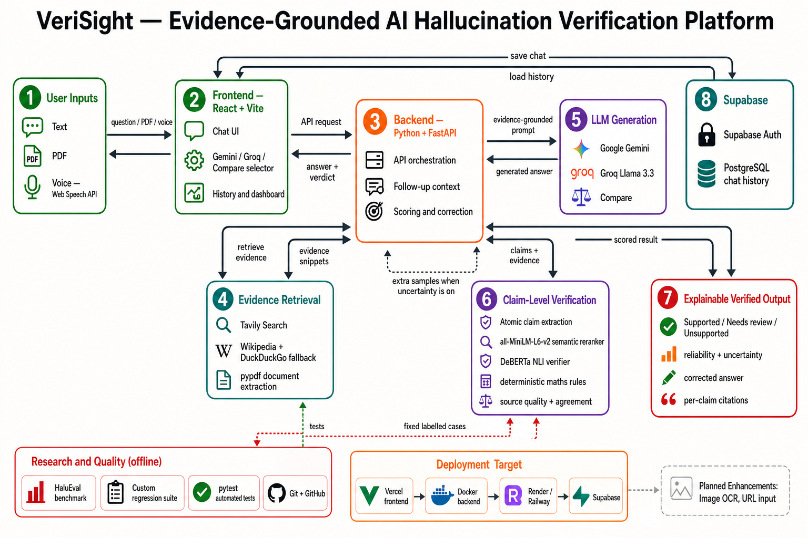

# VeriSight — Evidence-Grounded AI Hallucination Detection System

> An independent reliability layer for LLM answers. VeriSight retrieves evidence, verifies factual claims, highlights unsupported statements, and returns citations with explainable reliability and uncertainty signals.

## The problem

Large language models can produce fluent answers even when individual facts are unsupported, incomplete, or wrong. VeriSight gives people a way to inspect those facts instead of simply trusting the answer.

## What VeriSight does

Gemini or Groq first generates a candidate answer. VeriSight then independently checks it against web evidence, an uploaded PDF, or both.

```text
Question / PDF / Voice input
          |
          v
LLM answer (Gemini or Groq)
          |
          v
Atomic claim extraction
          |
          v
Relevant evidence retrieval and ranking
          |
          v
DeBERTa Natural Language Inference verifier
          |
          +--> Supported / Needs review / Unsupported
          |
          v
Reliability, uncertainty, citations, and evidence-grounded correction
```



## Key features

- **Claim-level hallucination detection** — labels every factual claim as supported, needs review, or unsupported.
- **Independent NLI verification** — a local DeBERTa Natural Language Inference model checks whether evidence entails, contradicts, or does not establish each claim.
- **Web, PDF, and hybrid evidence modes** — verifies against retrieved sources, an uploaded document, or both.
- **Evidence-linked citations** — shows sources relevant to individual claims rather than a large unrelated list.
- **Reliability and uncertainty signals** — separately measure evidence support and answer instability across repeated LLM samples.
- **Gemini/Groq comparison** — compares provider answers under the same evidence context.
- **Evidence-grounded corrections** — creates a safer correction only from evidence supporting the correction.
- **Follow-up-aware chat** — resolves short follow-ups using the preceding conversation.
- **Math-aware verification** — deterministic checks for supported arithmetic, calculus, factorial, and determinant questions.
- **Speech input, PDF upload, authentication, and saved conversations** — supports a practical end-user workflow.

## How claim verification works

For an answer such as:

> “Guido van Rossum created Python and its first version was released in 1991.”

VeriSight produces two claims:

1. Guido van Rossum created Python.
2. The first version of Python was released in 1991.

It selects the strongest evidence for each claim, then uses NLI to evaluate the evidence/claim pair:

| Verdict | Meaning |
|---|---|
| **Supported** | The evidence entails the claim. |
| **Unsupported** | The evidence contradicts the claim, or no usable evidence exists. |
| **Needs review** | The retrieved evidence is insufficient or conflicting. |

The UI shows verification confidence, source quality, source agreement, citations, and overall answer reliability.

## Why this is more than an LLM wrapper

| Generation layer | Verification layer |
|---|---|
| Gemini / Groq writes a candidate answer. | VeriSight retrieves evidence and independently evaluates factual claims. |
| Optimised for helpful natural-language answers. | Optimised for traceability, contradiction detection, and citation-backed feedback. |
| Can produce an incorrect but fluent statement. | Can flag that statement as unsupported or uncertain. |

## Technology stack

| Area | Technologies |
|---|---|
| Frontend | React, Vite, Supabase JavaScript client |
| Backend | Python, FastAPI, Pydantic, HTTPX |
| LLM providers | Google Gemini API, Groq API |
| Verification | DeBERTa NLI cross-encoder, Sentence Transformers / MiniLM semantic reranking |
| Evidence | Tavily-enabled web retrieval, source-quality filtering, PyPDF document extraction |
| Special verification | Deterministic arithmetic, calculus, factorial, and determinant rules |
| Data and authentication | Supabase Authentication and PostgreSQL |
| Evaluation | HaluEval held-out experiments and VeriSight custom regression suite |
| Deployment configuration | Render blueprint (`render.yaml`) |

## Evaluation

The `evaluation/` module tests the verification layer on fixed labelled claim/evidence examples. It does not consume Gemini, Groq, or web-search API quota.

The final HaluEval QA held-out experiment recorded:

| Measure | Result |
|---|---:|
| Cases | 400 |
| Accuracy | 68.25% |
| Macro F1 | 71.00% |
| Factual-claim subset accuracy | 70.73% |
| Hallucination-risk F1 | 72.51% |

These results measure claim verification, not the fluency of the LLM answer. See [evaluation/README.md](evaluation/README.md) for metrics, reproduction commands, and limitations.

## Repository structure

```text
backend/       FastAPI API, retrieval, generation, verification, and tests
frontend/      React chat interface, authentication, history, and evidence UI
evaluation/    HaluEval import, metric calculation, datasets, and regression cases
docs/          workflow diagrams, database schema, and literature survey
render.yaml    Render deployment blueprint
```

## Run locally

### Prerequisites

- Python 3.11 recommended
- Node.js 20+ recommended
- A Gemini and/or Groq API key
- Optional: Tavily API key for enhanced web retrieval
- Optional: a Supabase project for authentication and persistent history

### 1. Configure environment files

Create these files from the included examples. Never commit real keys.

```text
backend/.env    ← copy backend/.env.example
frontend/.env   ← copy frontend/.env.example
```

Add at least one provider key in `backend/.env`.

### 2. Start the backend

```powershell
cd backend
python -m venv .venv
.\.venv\Scripts\Activate.ps1
python -m pip install -r requirements.txt
python -m uvicorn app.main:app --reload --host 127.0.0.1 --port 8000
```

Verify it is available at `http://127.0.0.1:8000/health`.

### 3. Start the frontend

Open a second terminal:

```powershell
cd frontend
npm install
npm run dev
```

Open `http://localhost:5173`.

## Tests

From the project root:

```powershell
.\backend\.venv\Scripts\python.exe -m pytest backend\tests -q
```

Run a small evaluation smoke test:

```powershell
.\backend\.venv\Scripts\python.exe evaluation\run.py --limit 3
```

## Security and privacy

- `.env` files, API keys, virtual environments, Node modules, build output, and generated benchmark reports are excluded by `.gitignore`.
- The frontend only uses Supabase’s publishable key; provider secrets remain on the backend.
- Reliability is an evidence-based estimate, not a guarantee of universal truth. Missing, weak, stale, or conflicting sources should result in **Needs review**, rather than an unsupported claim being presented as verified.

## Documentation

- [Backend API documentation](backend/README.md)
- [Frontend documentation](frontend/README.md)
- [Evaluation methodology](evaluation/README.md)
- [Supabase schema](docs/supabase-schema.sql)
- [Core literature survey](docs/verisight_core_literature_survey_18_papers.docx)
